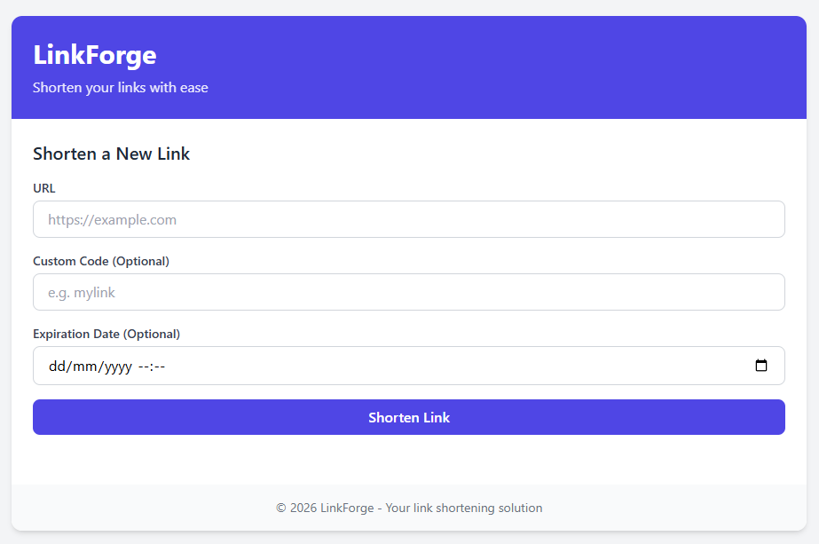
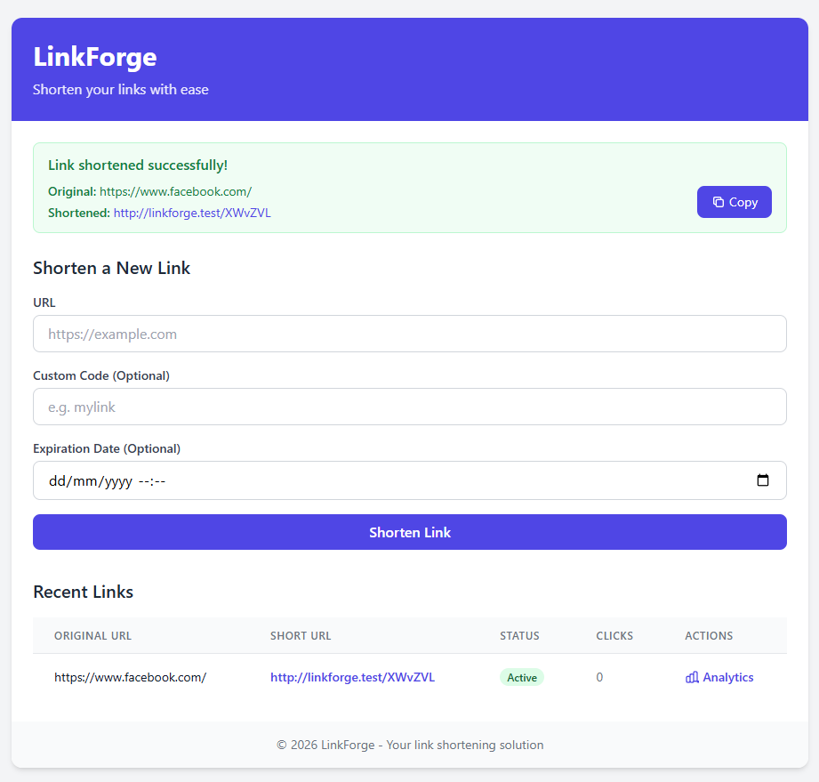
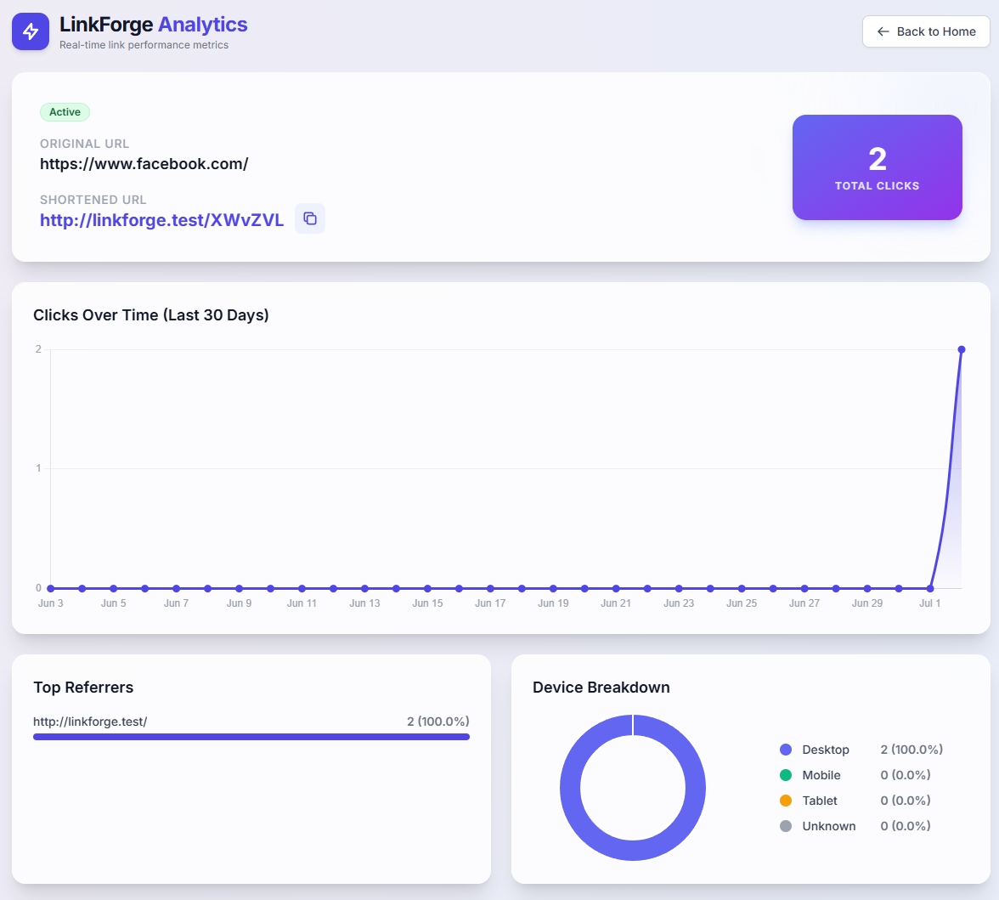

# LinkForge

URL shortener with click analytics (referrers, device breakdown, 30-day trend). Laravel 13, SQLite, Pest.

## Screenshots

| Generate a link | Link dashboard | Analytics |
| --- | --- | --- |
|  |  |  |

## Stack

- Laravel 13 / PHP
- SQLite
- Pest for tests
- Chart.js via CDN for the charts (no build step needed to see them)

## Installation

```bash
composer install
cp .env.example .env
php artisan key:generate
touch database/database.sqlite
php artisan migrate
php artisan db:seed   # optional: a test user + 20 sample links
```

Or in one shot:

```bash
composer run setup
```

The app runs at `https://linkforge.test` via Laravel Herd, or with `php artisan serve`.

## Queue and click tracking

The redirect (`RedirectController`) always works. Click counting doesn't necessarily: every visit to a short link dispatches a `RecordClick` job (`implements ShouldQueue`) instead of writing to the DB right away, so the redirect doesn't wait on the query. If the job is never processed, the counter stays stuck at zero even though redirects work fine — this is the easiest bug to hit locally.

There are two ways to make it work, depending on how you run the app:

**Option A — `QUEUE_CONNECTION=database` (default, meant for `composer run dev`)**

The job goes into the `jobs` table and needs a worker consuming it:

```bash
composer run dev
# runs together: php artisan serve + queue:listen + pail + vite
```

If instead you serve the app with **Laravel Herd** (`linkforge.test`), Herd only acts as the webserver: it does not start the worker. With `QUEUE_CONNECTION=database` and no `queue:work`/`queue:listen` running, jobs pile up in the `jobs` table and clicks never get persisted. In that case, start the worker separately, in its own terminal:

```bash
php artisan queue:work
```

**Option B — `QUEUE_CONNECTION=sync` (convenient with Herd, used in this local `.env`)**

The job runs in-process, synchronously with the redirect: no worker to keep open, the click shows up in the counter immediately. The cost is that the redirect responds a touch slower since it waits on the DB write — negligible for local/demo use, but worth avoiding if heavier jobs or high traffic get added later in production, where `database` (or `redis`) remains the right choice.

To check what's going on: `php artisan tinker --execute="DB::table('jobs')->count()"` — if the number keeps growing and never drops, a worker is missing.

## Commands

- Tests: `php artisan test`
- Migrations: `php artisan migrate`

## API

```
GET    /                        Homepage — form + recent links
POST   /                        Create a link (web form)
GET    /links/{code}/analytics  Analytics dashboard for a short code
GET    /{code}                  Redirect (catch-all, kept last in routes/web.php)

GET    /api/links               List links (paginated, 20/page)
POST   /api/links               Create a link
GET    /api/links/{id}          Show a link
DELETE /api/links/{id}          Delete a link
```

Rate limit `throttle:30,1` applies to all API routes.
